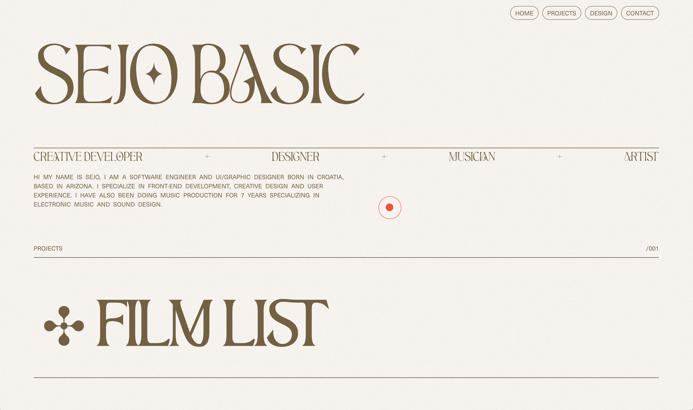
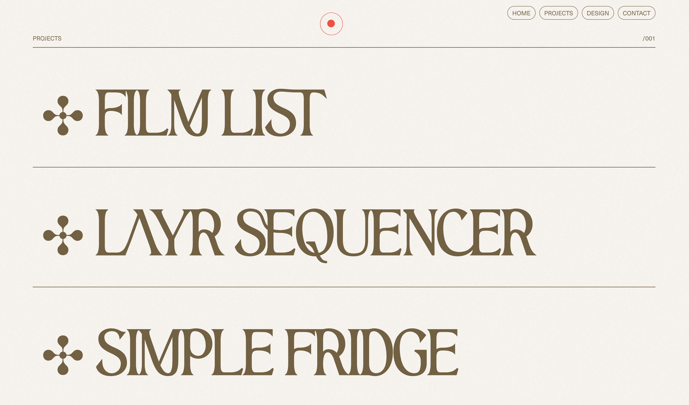
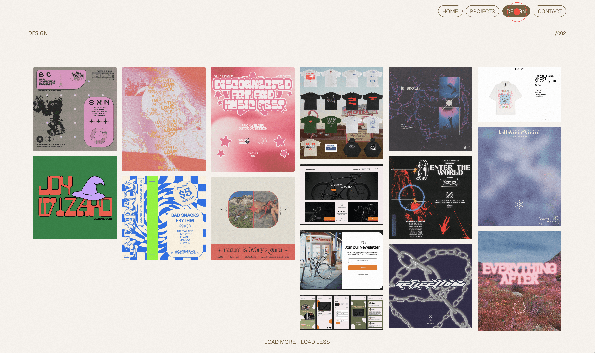
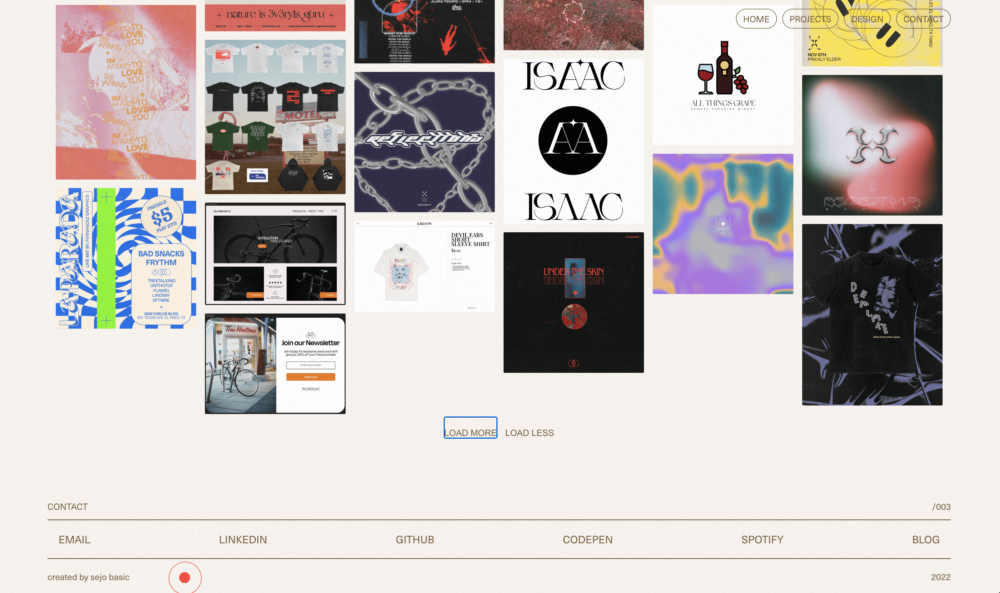

# PERSONAL PORTFOLIO V2

#### This is the second version of my portfolio. Working on my portfolio is always a ton of fun because i get to showcase my design and front-end work. I enjoyed using a React animation library called Framer Motion and learning about animating elements to make my site more interactive. The layout and styling was done in raw CSS.
#### I learned about a library called intersection observer that allowed me to render the animation while in view on the page using their useInView hook in React.

## Technologies Used

- React
- CSS
- Framer Motion
- Tilt.js
- Intersection Observer
- Adobe Photoshop

<!-- 

 -->